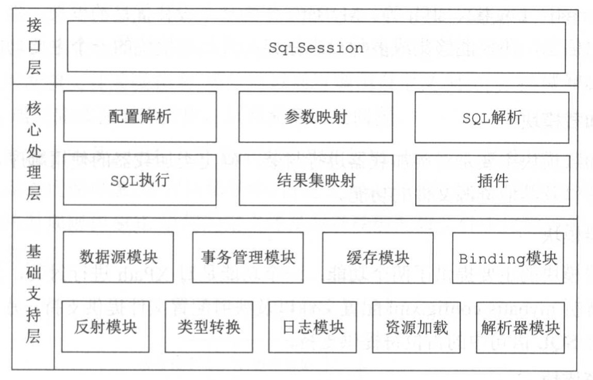

## 模块划分
| 模块 | 层次 | 定义 |
| :-----| ----: | :----: |
| session | 接口层 | 提供给外部使用的接口API |
| scripting | 核心处理层 | 解析映射文件中的动态SQL节点。并形成数据库可执行的SQL语句。 |
| mapping | 核心处理层 | 映射 |
| builder | 核心处理层 | 配置解析 |
| executor | 核心处理层 | 执行器模块，串联整个执行流程 |
| plugin | 核心处理层 | 插件模块：提供插件接口，通过自定义插件方式对MyBatis进行拓展 |
| cursor | 核心处理层 | 游标模块 |
| reflection | 基础支持层 | 反射模块：mybatis专门对反射模块进行封装。提供更加简单易用的API |
| type | 基础支持层 | 类型转换模块：Mybatis为简化配置提供了别名机制。提供java类型与JDBC类型转换 |
| logging | 基础支持层 | 日志模块：主要是集成第三方日志 |
| io | 基础支持层 | 资源加载模块：对类加载器进行了封装。确定类加载器顺序，并提供加载文件，以及其他资源的功能 |
| datasource | 基础支持层 | 数据源模块：mybatis自身提供响应的数据源实现，也提供与第三方数据集成的接口。 |
| transaction | 基础支持层 | 事务管理模块：Mybatis 对数据库的事务进行了抽象 |
| parsing | 基础支持层 | 解析器模块：提供两个功能：1. 对XPath进行封装 2为处理动态sql语句中的占位符提供支持 |
| cache | 基础支持层 | 缓存模块：提供一级缓存、二级缓存。优化查询 |
| binding | 基础支持层 | Binding模块：将自定义的接口与映射配置文件关联起来。通过调用mapper接口完成数据库执行。 |
| exceptions | 基础支持层 | 异常处理 |
| annotations | 基础支持层 | 注解模块 |
| jdbc | 其他 | JDBC模块 |
| lang | 其他 | Lang模块 |

## 整体结构
整体分为三层：  
* 接口层：定义了MyBatis暴露给应用程序调用的API。  
* 核心处理层：实现了MyBatis的核心处理流程，包括MyBatis初始化以及完成一次数据库操作的涉及的全部流程。  
* 基础支持层：为核心处理层提供了良好的基础支撑。例如：反射、类型转换、日志、缓存、事务等模块。  
